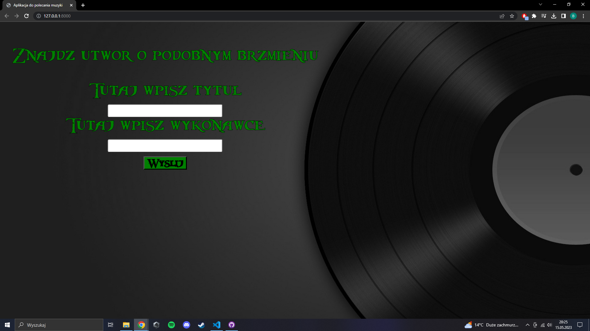
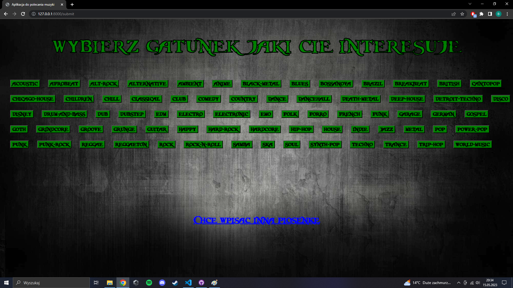
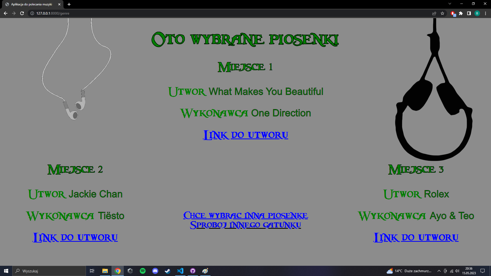

# Application for recommended music


# Description:

The application finds songs with the similar sound performance based on data such as energy mood rate, etc. Application use a simple neural network and the Spotify API. It was built on the FastAPI framework.

## License

Application is licensed under the MIT License.

# Instalation

## Copying the repository

```
git clone https://github.com/0lch4/Aplikacja-do-polecania-muzyki.git
```
## Installing liblaries

You have to use `poetry` to install liblaries:

```
pip install poetry
```

In next step enter in main project location:

```
poetry install
```

## .env file

You have to create `.env` like `.env.example`

`Spotify id` and `Spotify secret` you can get [here](https://developer.spotify.com/)

# Usage

When all dependencies are met, enter in the main location:

```
uvicorn app.main:app --reload
```

Application is avilable on:

```
http://localhost:8000/
```

## Running in Docker

For build container enter in main location:

```
docker build -t app .
```

In the next step enter in main location:

```
docker run -d --name app -p 3000:3000 --env-file .env app 
```

Application is avilable on:

```
http://localhost:3000/
```



